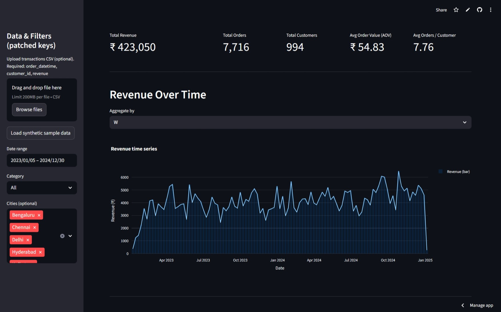
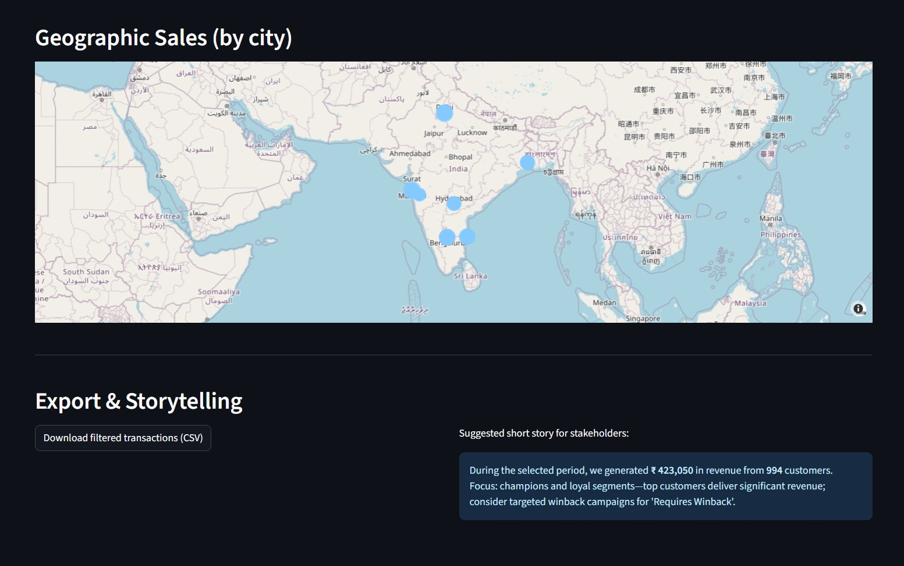

# 🚀 BI\_report

[](https://bi-report.streamlit.app/) [](./LICENSE) []()

> ✨ **Sales BI Dashboard** — A clean, developer‑friendly Streamlit app for Revenue, Orders, Customers, Cohorts, RFM segments, and Geographic sales.

---

## 🎯 Quick demo

Live demo: [https://bi-report.streamlit.app/](https://bi-report.streamlit.app/)


---

## 🚩 Why this project?

A pragmatic BI dashboard template for engineers who want something:

* ✅ Readable & extensible code
* ✅ Small-data friendly (CSV / SQLite)
* ✅ Production-minded (easy to deploy)

Perfect as a starter for analytics teams or for demoing product intelligence features.

---

## ✨ Key features

* 📊 KPI tiles: Revenue, Orders, Customers, AOV
* ⏱ Time-series revenue with rolling metrics
* 🏷️ Top categories & top customers analysis
* 🔥 Cohort retention heatmap (order date cohorts)
* 🧭 Geographic sales map (choropleth / scatter)
* 🧾 RFM segmentation (exportable CSV)

---

## 🧩 Visuals

Add these files under `assets/` to make the README lively:

* `assets/img_1.jpeg` — short app walkthrough
* `assets/img_2.jpeg` — Category Breakdown & Top Items
* `assets/img_3.jpeg` — cohort heatmap screenshot
* `assets/img_4.jpeg` — RFM Segmentation
* `assets/img_5.jpeg` — geographic map screenshot






---

## 🛠 Tech stack

* Python 3.8+
* Streamlit
* pandas, numpy
* plotly / altair / folium (optional map support)

See `requirements.txt` for pinned packages.

---

## ⚡ Quick start (dev)

```bash
# clone
git clone https://github.com/AkarshVante/BI_report.git
cd BI_report

# venv & install
python3 -m venv .venv
source .venv/bin/activate    # macOS / Linux
# For Windows PowerShell: .venv/Scripts/activate
pip install -r requirements.txt

# run (try both if unsure)
streamlit run streamlit_app.py
# or
streamlit run app.py
```

---

## 🗂 Expected data layout

Place CSVs in `data/`:

* `orders.csv` — order\_id, customer\_id, order\_date, total\_amount
* `customers.csv` — customer\_id, join\_date, region
* `products.csv` — product\_id, category, price

If you lack real data, include a `sample_data/` with synthetic rows.

---

## 🧭 Project structure

```
BI_report/
├─ app.py                # or streamlit_app.py (entry)
├─ requirements.txt
├─ README.md
├─ data/                 # CSVs / sample data
├─ assets/               # GIFs & screenshots
├─ src/                  # analytics & helpers
└─ LICENSE
```

---

## 🧪 Developer notes

* Keep analytics logic in `src/` so functions are testable.
* Use `st.cache_data` / `st.cache_resource` for expensive ops.
* Add unit tests and type hints for maintainability.

---

## 🐞 Troubleshooting (common issues)

* **Internal Error** on Streamlit Cloud → check entry file name and logs.
* **Missing map tiles** → set `MAPBOX_TOKEN` in Streamlit secrets.
* **Slow load** → cache computations and pre-aggregate large datasets.

---

## 📦 Deployment (Streamlit Cloud)

1. Push to GitHub
2. Create new app on Streamlit Cloud and point to the repo + entry file
3. Add secrets (MAPBOX\_TOKEN, DB creds) under app settings

---

## 🤝 Contributing

Contributions welcome!

1. Fork
2. Create branch `feature/your-thing`
3. Open a PR with screenshots & description

Good first PRs: tests + CI, Dockerfile, improved map visuals.

---

## 🗺 Roadmap

* [ ] Tests & CI
* [ ] Dockerfile + Make targets
* [ ] Data validation (pandera / great\_expectations)

---

## ✉️ Contact

Maintainer: Akarsh Vante — open issues or PRs on GitHub.

---

*Made with ❤️ and Streamlit*
